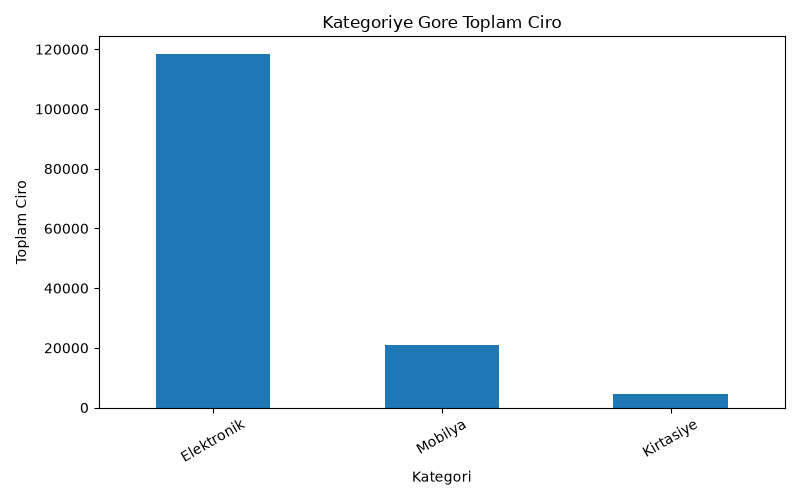
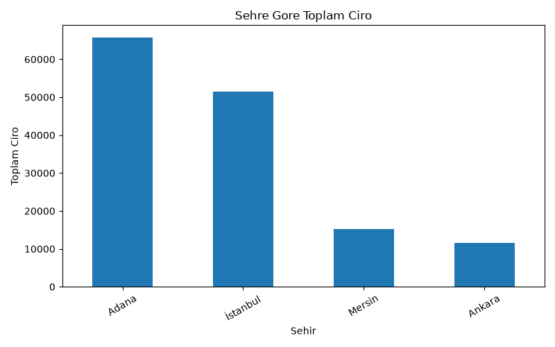
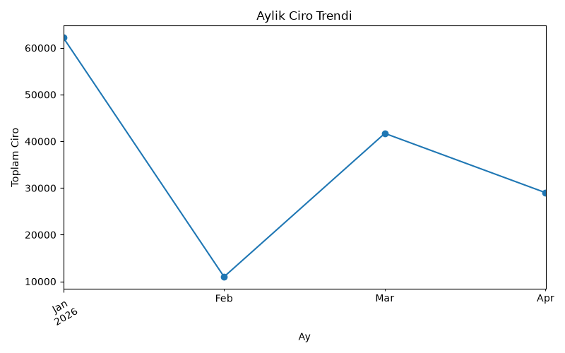
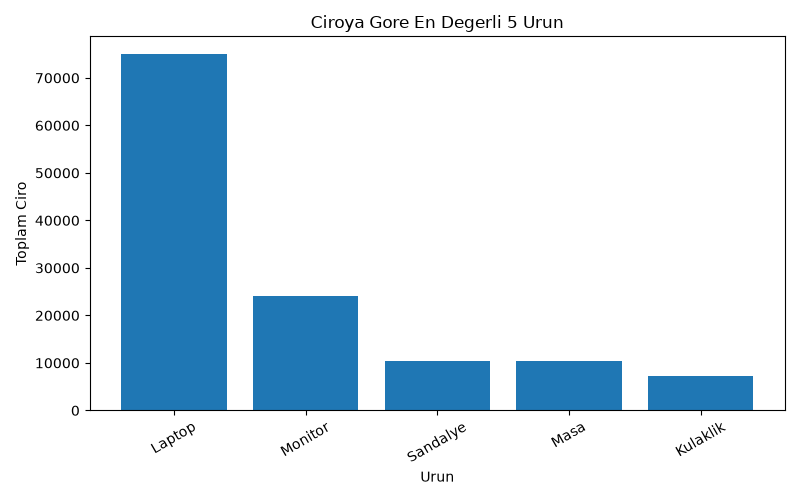

# python-learning
# Python Learning Journey

Bu repository, Python öğrenme sürecimde yaptığım temel çalışmalar, mini uygulamalar ve oyun projelerini içermektedir.

Amacım; Python temellerini öğrenmek, algoritma mantığımı geliştirmek, Git/GitHub kullanımına alışmak ve veri analisti olma yolunda güçlü bir teknik temel oluşturmaktır.

## Öğrendiğim Konular

* Python kurulumu
* VS Code kullanımı
* Git ve GitHub kullanımı
* `print()` fonksiyonu
* Değişkenler
* Veri tipleri: `str`, `int`, `float`, `bool`
* Kullanıcıdan veri alma: `input()`
* Tip dönüşümleri: `int()`, `float()`, `str()`
* Matematiksel operatörler
* Karşılaştırma operatörleri
* `if`, `elif`, `else`
* Mantıksal operatörler: `and`, `or`, `not`
* `while` döngüsü
* `for` döngüsü
* `range()` kullanımı
* Listeler
* `append()`, `remove()`, `len()`
* `random` modülü
* `break` ve `continue`

## Mini Uygulamalar

Bu repository içinde şu mini uygulamalar bulunmaktadır:

| Dosya                     | Açıklama                              |
| ------------------------- | ------------------------------------- |
| `hello.py`                | İlk Python programım                  |
| `variables.py`            | Değişkenler ve veri tipleri           |
| `input_test.py`           | `input()` ve tip dönüşümü çalışmaları |
| `operations.py`           | Matematiksel işlemler                 |
| `calculator.py`           | Basit hesap makinesi                  |
| `age.py`                  | Yaş kontrol uygulaması                |
| `positive_negative.py`    | Pozitif / negatif sayı kontrolü       |
| `even_odd.py`             | Tek / çift sayı kontrolü              |
| `grade.py`                | Not harf karşılığı hesaplama          |
| `login.py`                | Basit kullanıcı giriş sistemi         |
| `discount.py`             | Yaşa göre indirim uygulaması          |
| `while_examples.py`       | While döngüsü örnekleri               |
| `for_examples.py`         | For döngüsü örnekleri                 |
| `lists.py`                | Liste işlemleri                       |
| `student_list.py`         | Öğrenci listesi uygulaması            |
| `shopping_list.py`        | Alışveriş listesi uygulaması          |
| `number_guessing_game.py` | Sayı tahmin oyunu                     |
| `calculator_v2.py` | Hata yönetimi olan gelişmiş hesap makinesi   |
| `calculator_v3.py` | Menü sistemi olan, sürekli çalışan ve hata yönetimi bulunan hesap makinesi |
| `calculator_v4.py` | Fonksiyonlarla düzenlenmiş, menülü ve hata yönetimi olan hesap makinesi |
| `rock_paper_scissors.py` | Fonksiyon kullanılan taş kağıt makas oyunu |
| `rock_paper_scissors_v2.py` | Skor sistemi, sürekli oyun döngüsü ve çıkış seçeneği olan taş kağıt makas oyunu |
| `dictionary_examples.py` | Dictionary kullanımını gösteren temel örnekler |
| `student_card.py` | Kullanıcıdan alınan öğrenci bilgilerini dictionary içinde saklayan öğrenci kartı uygulaması |
| `student_registration_v1.py` | Birden fazla öğrenciyi liste içinde dictionary olarak saklayan öğrenci kayıt sistemi |
| `student_registration_v2.py` | Menü sistemi, öğrenci ekleme, öğrenci listeleme ve hata kontrolü olan öğrenci kayıt sistemi |
| `student_registration_v3.py` | Menü sistemi, öğrenci ekleme, listeleme ve isimle öğrenci arama özelliği olan öğrenci kayıt sistemi |
| `student_registration_v4.py` | Öğrenci ekleme, listeleme, isimle arama ve öğrenci silme özellikleri olan öğrenci kayıt sistemi |
| `student_registration_v5.py` | Öğrenci ekleme, listeleme, arama, silme ve öğrenci bilgisi güncelleme özellikleri olan öğrenci kayıt sistemi |
| `student_registration_v6.py` | Öğrenci ekleme, listeleme, arama, silme, güncelleme ve istatistik gösterme özellikleri olan öğrenci kayıt sistemi |
| `student_registration_v7.py` | JSON dosyasına veri kaydeden ve program tekrar açıldığında kayıtları yükleyen öğrenci kayıt sistemi |
| `student_registration_v8.py` | JSON kayıt sistemiyle çalışan, öğrenci numarası üzerinden ekleme, arama, silme, güncelleme ve istatistik özellikleri olan öğrenci kayıt sistemi |
| `student_registration_v9.py` | JSON kayıt sistemi, öğrenci numarası, ekleme, listeleme, arama, silme, güncelleme, istatistik ve gelişmiş giriş kontrolü olan final öğrenci kayıt sistemi |
| `csv_examples.py` | CSV dosyası oluşturma, CSV’ye ürün yazma ve CSV dosyasından ürün okuma örneği |
| `product_stock_v1.py` | CSV kayıt sistemiyle çalışan, ürün ekleme ve ürün listeleme özellikleri olan stok sistemi |
| `product_stock_v2.py` | CSV kayıt sistemiyle çalışan, ürün ekleme, listeleme ve ürün koduyla arama özellikleri olan stok sistemi |
| `product_stock_v3.py` | CSV kayıt sistemiyle çalışan; ürün ekleme, listeleme, arama, silme, güncelleme ve stok özeti gösterme özellikleri olan stok sistemi |
| `product_stock_v4.py` | CSV kayıt sistemiyle çalışan; ürün ekleme, listeleme, arama, silme, güncelleme, stok özeti ve kritik stok listeleme özellikleri olan stok sistemi |
| `pandas_intro.py` | Pandas DataFrame oluşturma, sütun seçme, filtreleme, yeni sütun ekleme ve temel hesaplama örnekleri |
| `pandas_csv_analysis.py` | Pandas ile CSV dosyası okuma, stok analizi, kritik stok filtreleme ve temel istatistik hesaplama örneği |
| `pandas_groupby_analysis.py` | Pandas groupby ile kategori bazlı ürün sayısı, toplam stok, toplam stok değeri, ortalama fiyat ve en yüksek fiyat analizi |
| `pandas_filter_sort.py` | Pandas ile kategori filtreleme, stok/fiyat koşullu filtreleme, sıralama ve ilk 3 kayıt seçme örnekleri |
| `pandas_export_reports.py` | Pandas analiz sonuçlarını yeni CSV rapor dosyalarına kaydetme örneği |
| `pandas_missing_values.py` | Pandas ile eksik veri kontrolü, NaN tespiti, fillna kullanımı ve temizlenmiş CSV oluşturma örneği |
| `pandas_data_cleaning_advanced.py` | Pandas ile bozuk veri tiplerini düzeltme, sayıya çevirme, tekrar eden satırları bulma ve temiz veri oluşturma örneği |
| `matplotlib_intro.py` | Pandas analiz sonucunu Matplotlib ile sütun grafik olarak görselleştirme ve PNG dosyası kaydetme örneği |
| `matplotlib_report_charts.py` | Matplotlib ile kategori stok değeri, en değerli ürünler ve kategori ürün sayısı için çoklu grafik raporu oluşturma örneği |
| `stock_analysis_report.py` | Kirli stok verisini temizleyen, kategori özeti çıkaran, kritik stok ve en değerli ürün raporları üreten, CSV ve grafik çıktıları oluşturan otomatik Pandas analiz projesi |
| `sales_analysis_project.py` | Satış verilerini analiz eden; kategori, şehir, aylık ciro ve ürün bazlı raporlar ile grafik çıktıları oluşturan Pandas ve Matplotlib projesi |
| `sales_pivot_analysis.py` | Pandas pivot_table ile kategori-şehir, aylık kategori ve müşteri tipi-kategori bazlı satış analizleri ve grafik raporları |
| `sales_insight_report.py` | Satış verilerinden toplam ciro, en güçlü kategori, şehir, ay ve ürünleri çıkararak otomatik metin analiz raporu oluşturan Pandas projesi |
| `sales_excel_report.py` | Satış analizinden çok sayfalı Excel raporu oluşturan ve Excel dosyasını tekrar okuyarak kontrol eden Pandas projesi |

## Öne Çıkan Mini Proje: Satış Analizi Projesi

Bu projede örnek bir satış veri seti Python, Pandas ve Matplotlib kullanılarak analiz edildi.

Amaç; satış verisinden ciro hesaplamak, kategori, şehir, ay ve ürün bazlı raporlar üretmek ve analiz sonuçlarını hem CSV dosyaları hem de grafiklerle sunmaktır.

### Proje Ne Yapıyor?

- `sales_data.csv` dosyasındaki satış verisini okur.
- Satış adedi ve birim fiyat üzerinden ciro hesaplar.
- Tarih bilgisinden ay bilgisi çıkarır.
- Kategori, şehir, ay ve ürün bazlı analizler yapar.
- Pivot tablolar ile iki boyutlu satış analizleri oluşturur.
- Analiz sonuçlarını CSV raporları olarak kaydeder.
- Matplotlib ile grafik raporları üretir.
- Analiz sonuçlarından otomatik metin raporu oluşturur.

### Kullanılan Araçlar

- Python
- Pandas
- Matplotlib
- CSV
- Git & GitHub

### Cevaplanan Analiz Soruları

- En yüksek ciro hangi kategoriden geldi?
- En yüksek ciro hangi şehirde oluştu?
- En güçlü satış ayı hangisi oldu?
- En çok ciro getiren ürün hangisi?
- En çok adet satan ürün hangisi?
- Aylara göre ciro değişimi nasıl ilerledi?
- Kategori ve şehir bazında satış performansı nasıl değişti?

### Örnek Veri Setinden Çıkan Sonuçlar

- Toplam ciro: 143.900 TL
- En yüksek ciro getiren kategori: Elektronik
- En yüksek ciro getiren şehir: Adana
- En güçlü satış ayı: 2026-01
- En yüksek ciro getiren ürün: Laptop
- En çok adet satan ürün: Kalem

### Ana Dosyalar

| Dosya | Açıklama |
|---|---|
| `sales_data.csv` | Satış verilerinin bulunduğu örnek veri seti |
| `sales_analysis_project.py` | Satış verisini analiz eden ana Python dosyası |
| `sales_pivot_analysis.py` | Pivot tablo mantığıyla kategori, şehir, ay ve müşteri tipi bazlı analiz yapan dosya |
| `sales_insight_report.py` | Analiz sonuçlarından otomatik metin raporu oluşturan dosya |
| `sales_insight_report.txt` | Program tarafından oluşturulan yazılı analiz raporu |

### Oluşturulan Grafikler

#### Kategoriye Göre Toplam Ciro



#### Şehre Göre Toplam Ciro



#### Aylık Ciro Trendi



#### Ciroya Göre En Değerli Ürünler



### Nasıl Çalıştırılır?

Projeyi çalıştırmak için terminalde ana analiz dosyasını çalıştırmak yeterlidir:

```bash
python sales_analysis_project.py
```

### Bu Projede Uygulanan Beceriler

Bu projede yalnızca veriyi ekrana yazdırmak yerine, ham satış verisinden anlamlı raporlar üretmeye odaklanıldı.

CSV dosyasından veri okuma, tarih verisini analiz için uygun formata çevirme, yeni hesaplama sütunları oluşturma, kategori ve şehir bazlı gruplama yapma, pivot tablo mantığını kullanma, sonuçları CSV dosyalarına aktarma ve grafiklerle görselleştirme adımları uygulandı.

Proje sonunda satış verisi; tablo, grafik ve metin raporu şeklinde yorumlanabilir hale getirildi.

## SAYI TAHMİN OYUNU

Bu mini oyunda bilgisayar 1 ile 20 arasında rastgele bir sayı tutar. Kullanıcının 5 tahmin hakkı vardır. Kullanıcının tahminine göre program daha büyük veya daha küçük bir sayı denemesini söyler.

### Kullanılan Konular

* `random.randint()`
* `while` döngüsü
* `if / elif / else`
* `input()`
* `int()` dönüşümü
* `break`
* `continue`
* Sayaç mantığı
* Tahmin hakkı kontrolü

### Oyunun Özellikleri

* Bilgisayar rastgele sayı üretir.
* Kullanıcıdan tahmin alır.
* Tahmin doğruysa oyun biter.
* Tahmin yanlışsa yönlendirme yapar.
* Kullanıcının kalan hakkını gösterir.
* 1-20 aralığı dışındaki girişleri kontrol eder.
* Kullanıcının kaç denemede bildiğini gösterir.
* Hatalı girişler `try-except` ile kontrol edilir.

## Hedefim

Bu repository, Python öğrenme sürecimin ilk aşamasıdır. İlerleyen süreçte daha gelişmiş projeler eklemeyi hedefliyorum:

* Taş Kağıt Makas Oyunu
* Adam Asmaca
* Quiz Uygulaması
* ATM Sistemi
* Öğrenci Yönetim Sistemi
* Stok Takip Sistemi
* Veri Analizi Projeleri
* SQL Projeleri
* Power BI Dashboard Projeleri

## Kullanılan Teknolojiler

* Python
* VS Code
* Git
* GitHub

## Not

Bu repository öğrenme sürecimi belgelemek için oluşturulmuştur. Her dosya, öğrendiğim bir konuyu veya küçük bir uygulamayı temsil eder.

