# Python & Data Analysis Portfolio

Bu repository, Python, Pandas, SQL mantığı, Excel, Matplotlib ve Power BI kullanarak geliştirdiğim veri analizi çalışmalarını ve portfolyo projelerimi içermektedir.

Ana odak noktam; ham veriyi analiz ederek rapor, grafik, Excel çıktısı ve Power BI dashboardu haline getirmektir.

Bu repository içinde hem Python öğrenme sürecimde yaptığım mini uygulamalar hem de veri analisti staj başvurularında kullanılabilecek daha kapsamlı portfolyo projeleri yer almaktadır.

## Öne Çıkan Büyük Proje: Satış, Stok ve Müşteri Analizi Karar Destek Sistemi

Bu projede örnek bir şirketin satış, stok, ürün ve müşteri verileri Python, Pandas, SQL mantığı, Matplotlib ve Excel raporlama kullanılarak analiz edildi.

Proje sonunda Python ile hazırlanan analiz çıktıları Power BI Desktop'a aktarılarak 3 sayfalı karar destek dashboardu oluşturuldu.

Amaç; farklı kaynaklardan gelen ham verileri birleştirerek şehir, kategori, müşteri tipi, ürün performansı, aylık satış trendi ve kritik stok riskleri hakkında yönetime karar desteği sağlayan bir analiz sistemi oluşturmaktır.

English project name: **Sales, Inventory and Customer Analytics Dashboard**

---

### Proje Ne Yapıyor?

- Müşteri, ürün, sipariş, sipariş ürünü ve stok verilerini oluşturur.
- 5 ayrı CSV dosyasını okuyarak tek ana satış tablosuna dönüştürür.
- Satış cirosu, toplam maliyet, kâr ve kâr marjı hesaplar.
- Şehir, kategori, müşteri tipi, ay ve ürün bazlı raporlar üretir.
- Kritik stoktaki ürünleri belirler.
- Türkçe CSV raporları oluşturur.
- Grafik dosyaları üretir.
- Yönetici özeti ve KPI raporu hazırlar.
- Tüm raporları tek Excel dosyasında ayrı sayfalar halinde toplar.

---

### Kullanılan Araçlar

- Python
- Pandas
- Matplotlib
- SQLite / SQL mantığı
- Excel raporlama
- openpyxl
- CSV
- Git & GitHub
- Power BI Desktop

---

### Veri Yapısı

Projede gerçek hayata yakın olacak şekilde birden fazla tablo kullanıldı.

| Dosya | Açıklama |
|---|---|
| `customers.csv` | Müşteri bilgileri |
| `products.csv` | Ürün, kategori, maliyet ve satış fiyatı bilgileri |
| `orders.csv` | Sipariş tarihi, müşteri ve satış kanalı bilgileri |
| `order_items.csv` | Siparişlerde yer alan ürün ve adet bilgileri |
| `inventory.csv` | Mevcut stok ve yeniden sipariş seviyesi bilgileri |

Bu tablolar ortak ID alanları üzerinden birleştirildi:

| Birleşim | Ortak Alan |
|---|---|
| `order_items` + `orders` | `order_id` |
| `orders` + `customers` | `customer_id` |
| `order_items` + `products` | `product_id` |
| `products` + `inventory` | `product_id` |

---

### Üretilen Raporlar

| Rapor | Açıklama |
|---|---|
| `ana_satis_verisi.csv` | Tüm tabloların birleşmiş ana satış veri seti |
| `sehir_ciro_raporu.csv` | Şehirlere göre ciro, kâr, satış adedi ve sipariş sayısı |
| `kategori_performans_raporu.csv` | Kategorilere göre ciro, kâr, satış adedi ve kâr marjı |
| `musteri_tipi_raporu.csv` | Bireysel ve kurumsal müşteri performansı |
| `aylik_ciro_raporu.csv` | Aylık ciro, kâr, satış adedi ve kümülatif ciro |
| `kritik_stok_raporu.csv` | Kritik stok seviyesindeki ürünler |
| `en_iyi_urunler_raporu.csv` | Ciroya göre en iyi ürünler |
| `yonetici_ozeti.txt` | Yönetici özeti, yorumlar ve karar önerileri |
| `yonetici_kpi_ozeti.csv` | Temel KPI değerleri |
| `satis_stok_musteri_analiz_raporu.xlsx` | Tüm raporları içeren tek Excel dosyası |

---

### Oluşturulan Grafikler

#### Şehirlere Göre Toplam Ciro
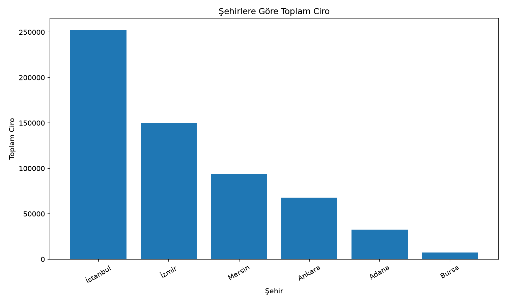

#### Kategorilere Göre Toplam Ciro
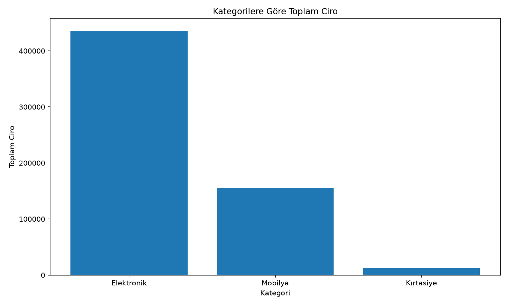

#### Aylara Göre Ciro Trendi
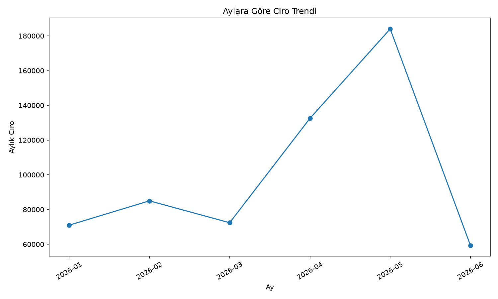

#### Aylara Göre Kümülatif Ciro
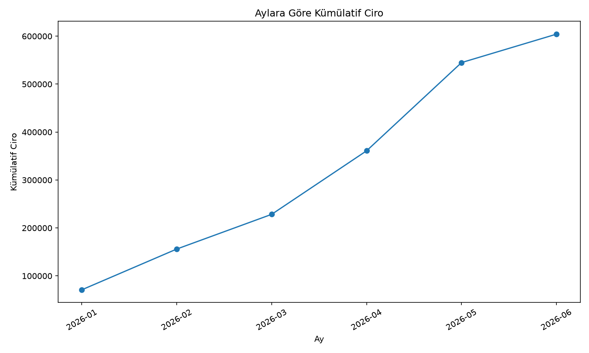

#### Müşteri Tipine Göre Toplam Ciro
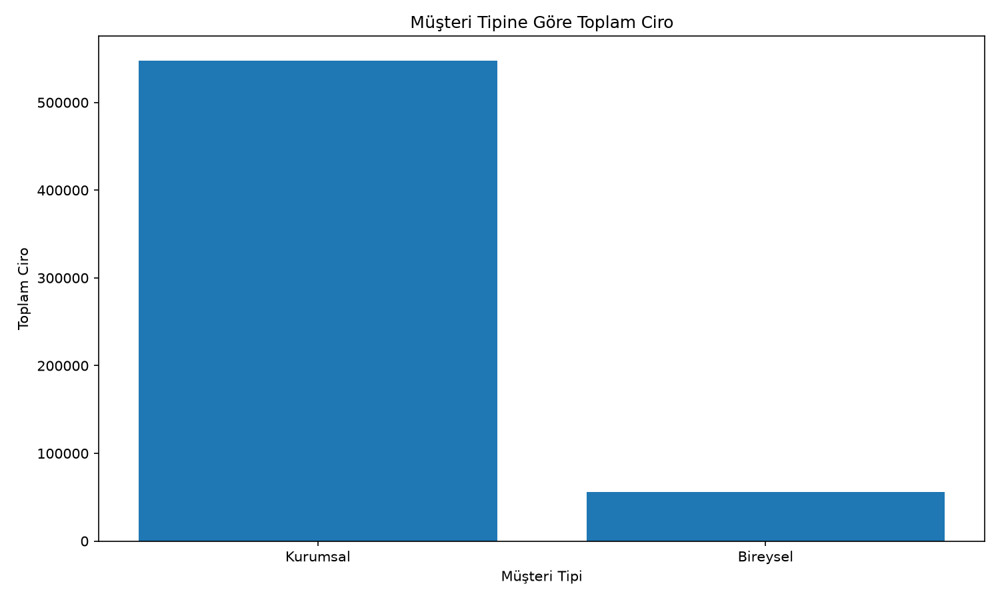

#### Ciroya Göre En İyi 5 Ürün
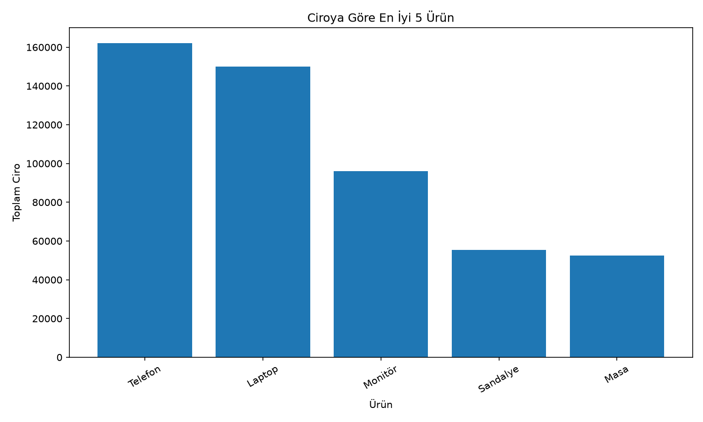

#### Kritik Stoktaki Ürünler
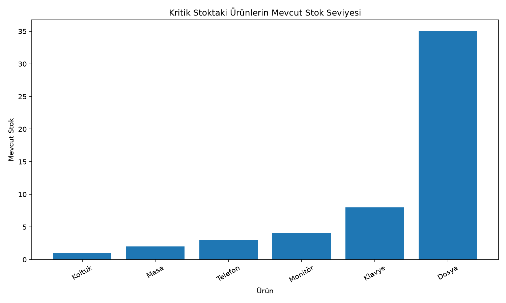

---

### Öne Çıkan Bulgular

- En yüksek ciro getiren şehir: **İstanbul**
- En yüksek ciro getiren kategori: **Elektronik**
- Kritik stokta bulunan ürünler tespit edildi.
- Aylık ciro trendi ve kümülatif ciro hesaplandı.
- Bireysel ve kurumsal müşteri tipleri gelir performansına göre karşılaştırıldı.
- En yüksek ciro getiren ürünler ve ürün kategorileri belirlendi.

---

### Yönetim İçin Öneriler

- En yüksek ciro getiren şehirlerdeki satış stratejileri detaylı incelenmelidir.
- Elektronik kategorisi için stok ve kampanya planlaması öncelikli yapılmalıdır.
- Kritik stoktaki ürünler için yeniden sipariş süreci hızlandırılmalıdır.
- Yüksek ciro getiren ürünlerin stok durumu düzenli takip edilmelidir.
- Aylık satış trendleri izlenerek düşük performanslı dönemler için kampanya planlanmalıdır.

---

### Power BI Dashboard

Bu projede Python ve Pandas ile hazırlanan ana satış verisi Power BI Desktop'a aktarılarak 3 sayfalı etkileşimli dashboard oluşturuldu.

Dashboard görselleri:

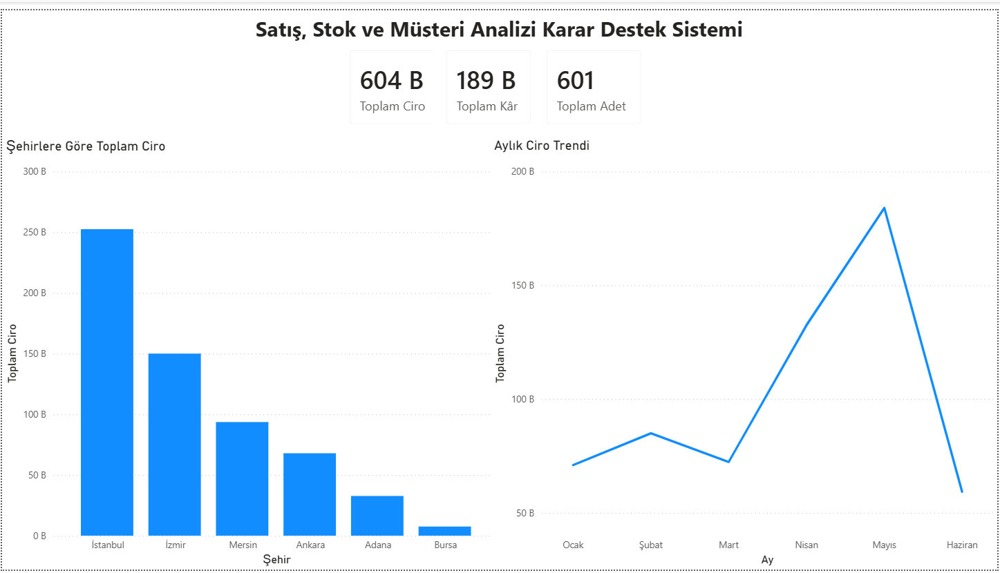

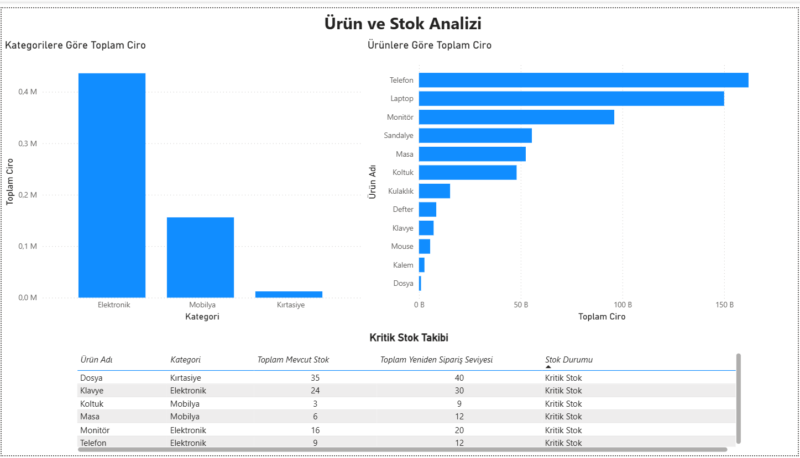

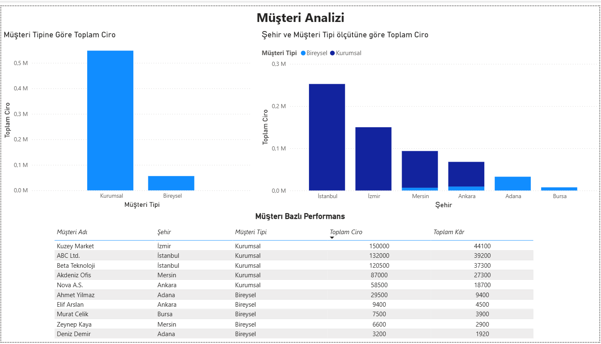

Dashboard sayfaları:

- Genel Bakış
- Ürün ve Stok Analizi
- Müşteri Analizi

Power BI dashboard dosyası:

[`sales_inventory_customer_analytics_dashboard.pbix`](sales_inventory_customer_analytics/dashboard/sales_inventory_customer_analytics_dashboard.pbix)

### Ana Proje Dosyaları

| Dosya | Açıklama |
|---|---|
| `generate_project_data.py` | Büyük proje için örnek müşteri, ürün, sipariş ve stok verilerini oluşturur |
| `analyze_sales_data.py` | CSV verilerini okur, tabloları birleştirir, hesaplamalar yapar ve rapor üretir |
| `create_project_charts.py` | Türkçe raporlardan grafikler oluşturur |
| `create_management_summary.py` | Yönetici özeti, KPI tablosu ve karar önerileri oluşturur |
| `create_excel_report.py` | Tüm raporları tek Excel dosyasında toplar |

---

### Çalıştırma Sırası

Projeyi baştan üretmek için dosyalar şu sırayla çalıştırılmalıdır:

```bash
python sales_inventory_customer_analytics/generate_project_data.py
python sales_inventory_customer_analytics/analyze_sales_data.py
python sales_inventory_customer_analytics/create_project_charts.py
python sales_inventory_customer_analytics/create_management_summary.py
python sales_inventory_customer_analytics/create_excel_report.py

```

### Bu Projede Uygulanan Beceriler

Bu projede yalnızca Python kodu yazmak değil, gerçek bir veri analizi sürecinin baştan sona nasıl yürütüleceği uygulandı.

Ham veri oluşturma, çoklu tablo yapısı kurma, ortak ID alanları üzerinden veri birleştirme, satış cirosu hesaplama, toplam maliyet ve kâr analizi, kâr marjı hesaplama, stok risk analizi, şehir ve kategori bazlı performans analizi, müşteri tipi karşılaştırması, aylık trend analizi, kümülatif ciro hesabı, grafik üretimi, yönetici özeti oluşturma ve Excel raporlama adımları tamamlandı.

Projede ayrıca veri çıktıları sadece tablo olarak bırakılmadı; grafikler, KPI özeti, yönetici yorumu ve karar önerileri ile desteklendi. Bu sayede proje, teknik bir Python çalışmasından ziyade iş kararlarına destek veren bir veri analizi projesi haline getirildi.

## Öğrendiğim Konular

* Python kurulumu
* VS Code kullanımı
* Git ve GitHub kullanımı
* `print()` fonksiyonu
* Değişkenler
* Veri tipleri: `str`, `int`, `float`, `bool`
* Kullanıcıdan veri alma: `input()`
* Tip dönüşümleri: `int()`, `float()`, `str()`
* Matematiksel operatörler
* Karşılaştırma operatörleri
* `if`, `elif`, `else`
* Mantıksal operatörler: `and`, `or`, `not`
* `while` döngüsü
* `for` döngüsü
* `range()` kullanımı
* Listeler
* `append()`, `remove()`, `len()`
* `random` modülü
* `break` ve `continue`

## Mini Uygulamalar ve Pratik Projeler

Bu repository içinde şu mini uygulamalar bulunmaktadır:

| Dosya                     | Açıklama                              |
| ------------------------- | ------------------------------------- |
| `hello.py`                | İlk Python programım                  |
| `variables.py`            | Değişkenler ve veri tipleri           |
| `input_test.py`           | `input()` ve tip dönüşümü çalışmaları |
| `operations.py`           | Matematiksel işlemler                 |
| `calculator.py`           | Basit hesap makinesi                  |
| `age.py`                  | Yaş kontrol uygulaması                |
| `positive_negative.py`    | Pozitif / negatif sayı kontrolü       |
| `even_odd.py`             | Tek / çift sayı kontrolü              |
| `grade.py`                | Not harf karşılığı hesaplama          |
| `login.py`                | Basit kullanıcı giriş sistemi         |
| `discount.py`             | Yaşa göre indirim uygulaması          |
| `while_examples.py`       | While döngüsü örnekleri               |
| `for_examples.py`         | For döngüsü örnekleri                 |
| `lists.py`                | Liste işlemleri                       |
| `student_list.py`         | Öğrenci listesi uygulaması            |
| `shopping_list.py`        | Alışveriş listesi uygulaması          |
| `number_guessing_game.py` | Sayı tahmin oyunu                     |
| `calculator_v2.py` | Hata yönetimi olan gelişmiş hesap makinesi   |
| `calculator_v3.py` | Menü sistemi olan, sürekli çalışan ve hata yönetimi bulunan hesap makinesi |
| `calculator_v4.py` | Fonksiyonlarla düzenlenmiş, menülü ve hata yönetimi olan hesap makinesi |
| `rock_paper_scissors.py` | Fonksiyon kullanılan taş kağıt makas oyunu |
| `rock_paper_scissors_v2.py` | Skor sistemi, sürekli oyun döngüsü ve çıkış seçeneği olan taş kağıt makas oyunu |
| `dictionary_examples.py` | Dictionary kullanımını gösteren temel örnekler |
| `student_card.py` | Kullanıcıdan alınan öğrenci bilgilerini dictionary içinde saklayan öğrenci kartı uygulaması |
| `student_registration_v1.py` | Birden fazla öğrenciyi liste içinde dictionary olarak saklayan öğrenci kayıt sistemi |
| `student_registration_v2.py` | Menü sistemi, öğrenci ekleme, öğrenci listeleme ve hata kontrolü olan öğrenci kayıt sistemi |
| `student_registration_v3.py` | Menü sistemi, öğrenci ekleme, listeleme ve isimle öğrenci arama özelliği olan öğrenci kayıt sistemi |
| `student_registration_v4.py` | Öğrenci ekleme, listeleme, isimle arama ve öğrenci silme özellikleri olan öğrenci kayıt sistemi |
| `student_registration_v5.py` | Öğrenci ekleme, listeleme, arama, silme ve öğrenci bilgisi güncelleme özellikleri olan öğrenci kayıt sistemi |
| `student_registration_v6.py` | Öğrenci ekleme, listeleme, arama, silme, güncelleme ve istatistik gösterme özellikleri olan öğrenci kayıt sistemi |
| `student_registration_v7.py` | JSON dosyasına veri kaydeden ve program tekrar açıldığında kayıtları yükleyen öğrenci kayıt sistemi |
| `student_registration_v8.py` | JSON kayıt sistemiyle çalışan, öğrenci numarası üzerinden ekleme, arama, silme, güncelleme ve istatistik özellikleri olan öğrenci kayıt sistemi |
| `student_registration_v9.py` | JSON kayıt sistemi, öğrenci numarası, ekleme, listeleme, arama, silme, güncelleme, istatistik ve gelişmiş giriş kontrolü olan final öğrenci kayıt sistemi |
| `csv_examples.py` | CSV dosyası oluşturma, CSV’ye ürün yazma ve CSV dosyasından ürün okuma örneği |
| `product_stock_v1.py` | CSV kayıt sistemiyle çalışan, ürün ekleme ve ürün listeleme özellikleri olan stok sistemi |
| `product_stock_v2.py` | CSV kayıt sistemiyle çalışan, ürün ekleme, listeleme ve ürün koduyla arama özellikleri olan stok sistemi |
| `product_stock_v3.py` | CSV kayıt sistemiyle çalışan; ürün ekleme, listeleme, arama, silme, güncelleme ve stok özeti gösterme özellikleri olan stok sistemi |
| `product_stock_v4.py` | CSV kayıt sistemiyle çalışan; ürün ekleme, listeleme, arama, silme, güncelleme, stok özeti ve kritik stok listeleme özellikleri olan stok sistemi |
| `pandas_intro.py` | Pandas DataFrame oluşturma, sütun seçme, filtreleme, yeni sütun ekleme ve temel hesaplama örnekleri |
| `pandas_csv_analysis.py` | Pandas ile CSV dosyası okuma, stok analizi, kritik stok filtreleme ve temel istatistik hesaplama örneği |
| `pandas_groupby_analysis.py` | Pandas groupby ile kategori bazlı ürün sayısı, toplam stok, toplam stok değeri, ortalama fiyat ve en yüksek fiyat analizi |
| `pandas_filter_sort.py` | Pandas ile kategori filtreleme, stok/fiyat koşullu filtreleme, sıralama ve ilk 3 kayıt seçme örnekleri |
| `pandas_export_reports.py` | Pandas analiz sonuçlarını yeni CSV rapor dosyalarına kaydetme örneği |
| `pandas_missing_values.py` | Pandas ile eksik veri kontrolü, NaN tespiti, fillna kullanımı ve temizlenmiş CSV oluşturma örneği |
| `pandas_data_cleaning_advanced.py` | Pandas ile bozuk veri tiplerini düzeltme, sayıya çevirme, tekrar eden satırları bulma ve temiz veri oluşturma örneği |
| `matplotlib_intro.py` | Pandas analiz sonucunu Matplotlib ile sütun grafik olarak görselleştirme ve PNG dosyası kaydetme örneği |
| `matplotlib_report_charts.py` | Matplotlib ile kategori stok değeri, en değerli ürünler ve kategori ürün sayısı için çoklu grafik raporu oluşturma örneği |
| `stock_analysis_report.py` | Kirli stok verisini temizleyen, kategori özeti çıkaran, kritik stok ve en değerli ürün raporları üreten, CSV ve grafik çıktıları oluşturan otomatik Pandas analiz projesi |
| `sales_analysis_project.py` | Satış verilerini analiz eden; kategori, şehir, aylık ciro ve ürün bazlı raporlar ile grafik çıktıları oluşturan Pandas ve Matplotlib projesi |
| `sales_pivot_analysis.py` | Pandas pivot_table ile kategori-şehir, aylık kategori ve müşteri tipi-kategori bazlı satış analizleri ve grafik raporları |
| `sales_insight_report.py` | Satış verilerinden toplam ciro, en güçlü kategori, şehir, ay ve ürünleri çıkararak otomatik metin analiz raporu oluşturan Pandas projesi |
| `sales_excel_report.py` | Satış analizinden çok sayfalı Excel raporu oluşturan ve Excel dosyasını tekrar okuyarak kontrol eden Pandas projesi |
| `sql_intro.py` | SQLite ile veritabanı oluşturma, tablo ekleme, veri kaydetme, SELECT, WHERE ve ORDER BY sorgularını öğrenme örneği |
| `sql_groupby_analysis.py` | SQLite ile COUNT, SUM, AVG, MAX, MIN, GROUP BY, AS ve HAVING kullanarak satış verisi üzerinde özet analiz yapan SQL örneği |
| `sql_join_analysis.py` | SQLite ile INNER JOIN, LEFT JOIN, ortak id üzerinden tablo birleştirme ve siparişi olmayan müşterileri bulma örneği |
| `sql_case_when_analysis.py` | SQLite ile CASE WHEN kullanarak fiyat grubu, ciro grubu ve müşteri segmenti sınıflandırması yapan SQL örneği |
| `sql_filtering_analysis.py` | SQLite ile DISTINCT, BETWEEN, IN, LIKE, AND, OR ve LIMIT kullanarak ürün verisi üzerinde filtreleme yapan SQL örneği |
| `sql_subquery_analysis.py` | SQLite ile subquery kullanarak ortalamanın üstündeki ürünleri, yüksek cirolu satışları ve en iyi kategori/şehir analizlerini yapan SQL örneği |
| `sql_window_functions_analysis.py` | SQLite ile ROW_NUMBER, RANK, PARTITION BY, SUM OVER ve kümülatif ciro hesaplamalarını yapan SQL window functions örneği |
| `sales_inventory_customer_analytics/analyze_sales_data.py` | Satış, stok ve müşteri verilerini birleştirerek şehir, kategori, müşteri tipi, aylık ciro, kritik stok ve en iyi ürün raporları oluşturan büyük veri analizi projesi |
| `sales_inventory_customer_analytics/create_project_charts.py` | Türkçe satış raporlarından şehir ciro, kategori ciro, aylık trend, kümülatif ciro, müşteri tipi, en iyi ürünler ve kritik stok grafiklerini oluşturan görselleştirme dosyası |
| `sales_inventory_customer_analytics/create_management_summary.py` | Satış, stok ve müşteri raporlarından yönetici özeti, KPI tablosu, yorumlar ve karar önerileri oluşturan proje dosyası |
| `sales_inventory_customer_analytics/create_excel_report.py` | Satış, stok, müşteri, KPI ve yönetici özeti raporlarını tek Excel dosyasında ayrı sayfalar halinde oluşturan proje dosyası |

## Öne Çıkan Mini Proje: Satış Analizi Projesi

Bu projede örnek bir satış veri seti Python, Pandas ve Matplotlib kullanılarak analiz edildi.

Amaç; satış verisinden ciro hesaplamak, kategori, şehir, ay ve ürün bazlı raporlar üretmek ve analiz sonuçlarını hem CSV dosyaları hem de grafiklerle sunmaktır.

### Proje Ne Yapıyor?

- `sales_data.csv` dosyasındaki satış verisini okur.
- Satış adedi ve birim fiyat üzerinden ciro hesaplar.
- Tarih bilgisinden ay bilgisi çıkarır.
- Kategori, şehir, ay ve ürün bazlı analizler yapar.
- Pivot tablolar ile iki boyutlu satış analizleri oluşturur.
- Analiz sonuçlarını CSV raporları olarak kaydeder.
- Matplotlib ile grafik raporları üretir.
- Analiz sonuçlarından otomatik metin raporu oluşturur.

### Kullanılan Araçlar

- Python
- Pandas
- Matplotlib
- CSV
- Git & GitHub

### Cevaplanan Analiz Soruları

- En yüksek ciro hangi kategoriden geldi?
- En yüksek ciro hangi şehirde oluştu?
- En güçlü satış ayı hangisi oldu?
- En çok ciro getiren ürün hangisi?
- En çok adet satan ürün hangisi?
- Aylara göre ciro değişimi nasıl ilerledi?
- Kategori ve şehir bazında satış performansı nasıl değişti?

### Örnek Veri Setinden Çıkan Sonuçlar

- Toplam ciro: 143.900 TL
- En yüksek ciro getiren kategori: Elektronik
- En yüksek ciro getiren şehir: Adana
- En güçlü satış ayı: 2026-01
- En yüksek ciro getiren ürün: Laptop
- En çok adet satan ürün: Kalem


### Ana Dosyalar

| Dosya | Açıklama |
|---|---|
| `sales_data.csv` | Satış verilerinin bulunduğu örnek veri seti |
| `sales_analysis_project.py` | Satış verisini analiz eden ana Python dosyası |
| `sales_pivot_analysis.py` | Pivot tablo mantığıyla kategori, şehir, ay ve müşteri tipi bazlı analiz yapan dosya |
| `sales_insight_report.py` | Analiz sonuçlarından otomatik metin raporu oluşturan dosya |
| `sales_insight_report.txt` | Program tarafından oluşturulan yazılı analiz raporu |

### Oluşturulan Grafikler

#### Kategoriye Göre Toplam Ciro

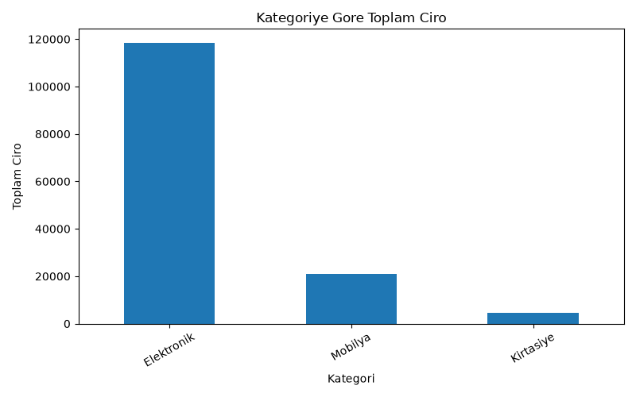

#### Şehre Göre Toplam Ciro

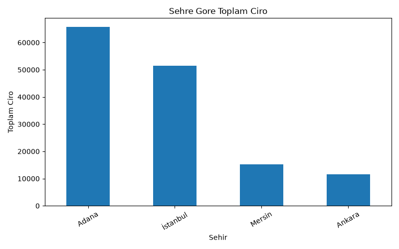

#### Aylık Ciro Trendi

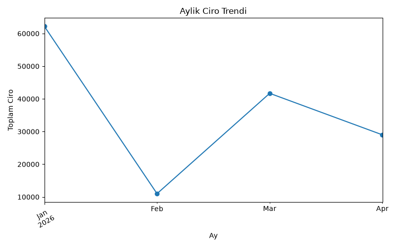

#### Ciroya Göre En Değerli Ürünler

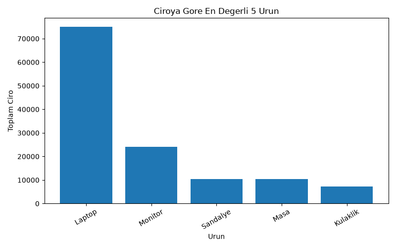

### Nasıl Çalıştırılır?

Projeyi çalıştırmak için terminalde ana analiz dosyasını çalıştırmak yeterlidir:

```bash
python sales_analysis_project.py
```

### Bu Projede Uygulanan Beceriler

Bu projede yalnızca veriyi ekrana yazdırmak yerine, ham satış verisinden anlamlı raporlar üretmeye odaklanıldı.

CSV dosyasından veri okuma, tarih verisini analiz için uygun formata çevirme, yeni hesaplama sütunları oluşturma, kategori ve şehir bazlı gruplama yapma, pivot tablo mantığını kullanma, sonuçları CSV dosyalarına aktarma ve grafiklerle görselleştirme adımları uygulandı.

Proje sonunda satış verisi; tablo, grafik ve metin raporu şeklinde yorumlanabilir hale getirildi.

## SAYI TAHMİN OYUNU

Bu mini oyunda bilgisayar 1 ile 20 arasında rastgele bir sayı tutar. Kullanıcının 5 tahmin hakkı vardır. Kullanıcının tahminine göre program daha büyük veya daha küçük bir sayı denemesini söyler.

### Kullanılan Konular

* `random.randint()`
* `while` döngüsü
* `if / elif / else`
* `input()`
* `int()` dönüşümü
* `break`
* `continue`
* Sayaç mantığı
* Tahmin hakkı kontrolü

### Oyunun Özellikleri

* Bilgisayar rastgele sayı üretir.
* Kullanıcıdan tahmin alır.
* Tahmin doğruysa oyun biter.
* Tahmin yanlışsa yönlendirme yapar.
* Kullanıcının kalan hakkını gösterir.
* 1-20 aralığı dışındaki girişleri kontrol eder.
* Kullanıcının kaç denemede bildiğini gösterir.
* Hatalı girişler `try-except` ile kontrol edilir.

## Hedefim

Bu repository, Python öğrenme sürecimin ilk aşamasıdır. İlerleyen süreçte daha gelişmiş projeler eklemeyi hedefliyorum:

* Taş Kağıt Makas Oyunu
* Adam Asmaca
* Quiz Uygulaması
* ATM Sistemi
* Öğrenci Yönetim Sistemi
* Stok Takip Sistemi
* Veri Analizi Projeleri
* SQL Projeleri
* Power BI Dashboard Projeleri

## Kullanılan Teknolojiler

* Python
* VS Code
* Git
* GitHub

## Not

Bu repository öğrenme sürecimi belgelemek için oluşturulmuştur. Her dosya, öğrendiğim bir konuyu veya küçük bir uygulamayı temsil eder.

